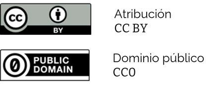

# Ciencia abierta y datos abiertos

Para entender a qué nos referimos con lo "abierto” en el contexto de la ciencia abierta y los datos abiertos, vamos a empezar con la definición del conocimiento abierto.

> "El conocimiento es abierto si cualquiera es libre de acceder a él, usarlo, modificarlo y compartirlo, estando sujeto a lo sumo a medidas que preserven su autoría y su apertura."
> https://opendefinition.org/od/2.1/es/

Esto significa que cuando el conocimiento es abierto, cualquier persona puede usarlo para cualquier fin, de cualquier forma, sin restricciones. Más adelante veremos las condiciones técnicas y legales a las que se refieren esas medidas para conservar la autoría y la apertura del conocimiento. 

La definición del conocimiento abierto se puede aplicar a cualquier tipo de contenido digital e impreso: textos, imágenes, audios, videos, software, datos, tanto académicos como no académicos. Aquí nos vamos a enfocar a materiales académicos y en especial a datos. 

El conocimiento abierto tiene más visibilidad y llega a más personas, incluyendo el público en general. Por lo tanto, el conocimiento tiene un mayor impacto, incluso fuera del ámbito académico y puede llegar a informar la política pública. También hay beneficios económicos, no sólo en los medios de publicación y de difusión, sino al evitar duplicar esfuerzos. Si los resultados de un trabajo se publican de forma abierta, entonces alguien más puede tomarlos y construir sobre ese trabajo en vez de empezar de cero. Además, abrir el conocimiento ayuda tener más igualdad de condiciones para acceder a él.

Pero, ¿todo el conocimiento debe ser abierto? ¿Qué pasa con la información personal o sensible? El conocimiento no tiene que ser sólo abierto o sólo cerrado, hay un gradiente para su nivel de apertura. Es posible elegir cómo queremos dar acceso al conocimiento que generamos y establecer las condiciones para compartirlo, usarlo y modificarlo. Esta es una consideración ética y legal importante a la cual dedicamos una sección más adelante.

## Ciencia abierta

La ciencia abierta se inspira en la definición anterior del conocimiento abierto, aplicada al contexto de la investigación científica. La ciencia abierta es un conjunto de prácticas y herramientas orientadas a que el conocimiento científico, desde la generación de preguntas hasta la difusión de los resultados, sea accesible y que todas las personas puedan usarlo y compartirlo. 

Algunas prácticas y herramientas de ciencia abierta que apoyan y enriquecen el proceso de la investigación son:

* Acceso abierto.
* Hardware abierto.
* Código abierto.
* Revisión abierta de pares.
* Ciencia ciudadana.
* Pre-publicaciones.
* Datos abiertos.

La ciencia abierta va más allá de las herramientas. También abarca un conjunto de valores que priorizan la colaboración y la equidad en la generación del conocimiento. En el fondo, la ciencia abierta cuestiona cómo se realiza la investigación científica que históricamente ha excluído regiones, personas y algunos tipos de conocimiento. Propone alternativas para colaborar y difundir los productos de la investigación de una forma más equitativa, inclusiva y justa. En el [Manifiesto de la Ciencia Abierta y Colaborativa de OCSDnet](https://ocsdnet.org/wp-content/uploads/2015/04/Manifesto-Infographic-Spanish-1.pdf
), se proponen una serie de principios que enmarcan las herramientas que ya se mencionaron.

## Datos abiertos

> "Datos abiertos son datos que son puestos a disposición con las características técnicas y jurídicas necesarias para que puedan ser usados, reutilizados y redistribuidos libremente por cualquier persona, en cualquier momento y en cualquier lugar.”
> Carta Internacional de Datos Abiertos: https://opendatacharter.net/principles-es/

¿Qué hace que un conjunto de datos sea abierto? Por un lado, las características técnicas se refieren, como mínimo, a que los datos se compartan en formatos no propietarios y que sean legibles por computadoras. 

Por otro lado, las características jurídicas se refieren a que los datos tengan asignada una [licencia de uso](https://creativecommons.org/licenses/?lang=es). Las licencias son herramientas legales que definen las condiciones en las que se pueden usar los datos. Las licencias recomendadas para datos abiertos son:

* [Creative Commons de atribución (CC BY)](https://creativecommons.org/licenses/by/4.0/deed.es). Permite compartir y adaptar sin restricciones, con el requisito de dar atribución a quienes generaron o publicaron los datos.

* Dominio público (CC0). Permite compartir y adaptar sin restricciones. 

Aunque a veces se usan los términos de forma indistinta, público no es lo mismo que abierto. Sin una licencia explícita que nos indique cómo podemos usar los datos, no debemos asumir que son abiertos, incluso si están disponibles de forma pública sin costo.

## Importancia

Conservar la agrobiodiversidad requiere colaboración respaldada por información muy diversa. Los datos abiertos de agrobiodiversidad pueden ayudar a:
* Identificar vacíos de información.
* Planificar, gestionar y evaluar políticas públicas.
* Monitorear.
* Facilitar colaboración intersectorial.

## Datos abiertos en CONABIO

Desde su creación, CONABIO tiene un compromiso como institución para publicar datos abiertos [Ref]. Este compromiso se basa en los siguientes principios:

* Publicar datos primarios desagregados y en formatos operables por computadoras.
* Diseñar sistemas de información electrónicos.
* Publicar datos de acceso público, en línea, de manera abierta. 

El SNIB y el SIAgro reflejan estos principios. 

