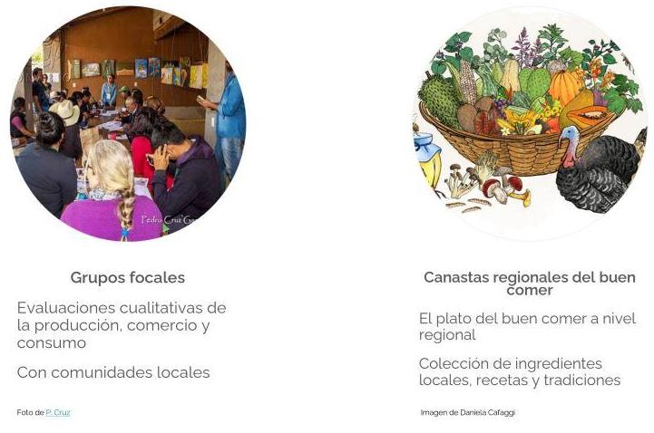

# Datos de agrobiodiversidad

La agrobiodiversidad abarca el conjunto de plantas, animales, hongos y microoorganismos recolectados, cultivados y domesticados para la alimentación y otros usos, así como sus parientes silvestres. También incluye a los componentes que sostienen a los agroecosistemas (microorganismos del suelo, depredadores, polinizadores y otra biodiversidad asociada). En ambos casos la agrobiodiversidad incluye la diversidad a nivel ecosistema, especie y genes (Casas y Vallejo, 2019, Jackson et al., 2007 y FAO, 2004). La agrobiodiversidad nace de la interacción entre la diversidad biológica y cultural, por lo que al hablar de agrobiodiversidad también hablamos de las relaciones entre las sociedades humanas, las plantas cultivadas y los ambientes en que conviven  [Ref: Adaptado de la página de CONABIO]. 

Así como la agrobiodiversidad abarca múltiples componentes y escalas, los datos relacionados con ella también son muy diversos, en cuanto a los tipos de materiales, las disciplinas, los formatos y las metodologías que se usan.

El **tipo de material** que se colecta en campo puede ser:
* Observaciones.
* Ejemplares para herbario. 
* Accesiones. 

La información que se colecta de la agrobiodiversidad abarca varias **disciplinas**:
* Datos biológicos.
* Datos geográficos.
* Datos socioeconómicos.
* Datos culturales.
* Datos agronómicos.
* Datos nutricionales.

Los datos relacionados con la agrobiodiversidad pueden venir en diferentes **formatos**:
* Capas de información geográfica.
* Texto.
* Imágenes.
* Sonido. 
* Tablas planas. 

Los datos de agrobiodiversidad se pueden colectar con varias **metodologías**:
* Cualitativas como entrevistas, encuestas o grupos focales.
* Cuantitativas como mediciones.

## ¿Qué distingue a los datos de agrobiodiversidad?

Los datos de agrobiodiversidad tienen algunas características que los distinguen de los datos sobre biodiversidad en general.

* **Diversidad**. Como ya vimos, los datos relacionados con la agrobiodiversidad son muy variados. Es imposible separar los componentes sociales, culturales y agronómicos de los componentes biológicos y geográficos, que son los más comúnes para datos de biodiversidad. Frecuentemente, se usan métodos cualitativos para recuperar la información sociocultural de la agrobiodiversidad. 
* **Participación de donantes, informantes o comunidades**. Muchos datos de agrobiodiversidad se colectan en colaboración con donantes, informantes o comunidades, quienes conocen las prácticas de manejo, usos, nombres locales, entre otra información local valiosa.
* **Estándares de datos poco desarrollados**. Los estándares para datos socioeconómicos, culturales y agronómicos están muy poco desarrollados en comparación con las décadas de avances para los datos biológicos y geográficos. 

Estas características traen consigo retos particulares para el manejo de datos de agrobiodiversidad. Por ejemplo, retos para generar las mismas bases de datos, retos para integrar los datos o relacionarlos, retos éticos y de colaboración. Más adelante daremos detalles sobre algunos de estos retos y recomendaciones para atenderlos.

## Datos de agrobiodiversidad en CONABIO

### Datos en SIAgro

El SIAgro reúne diversas bases de datos relacionadas con la agrobiodiversidad mexicana. Aquí resumimos las principales:

### Otros datos relacionados en CONABIO

Además del SIAgro, el SNIB, el Geoportal, Enciclovida y el Banco de Imágenes guardan otro tipo de datos relacionados con la agrobiodiversidad como mapas de uso de suelo, mapas de la distribución potencial de especies o fotografías de ejemplares.

