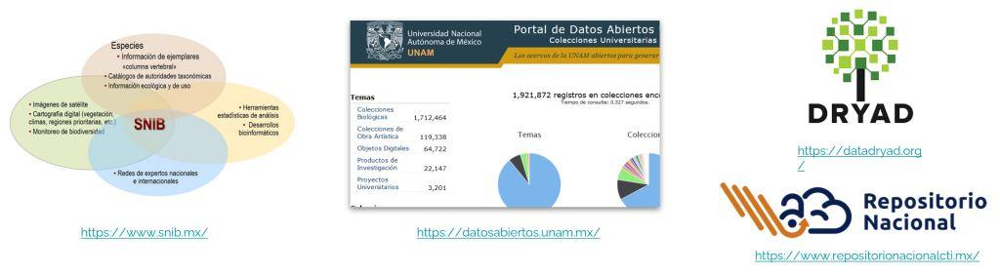
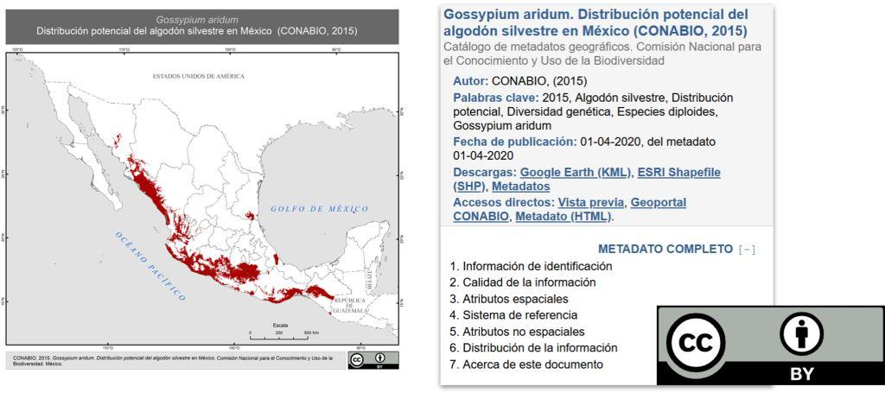
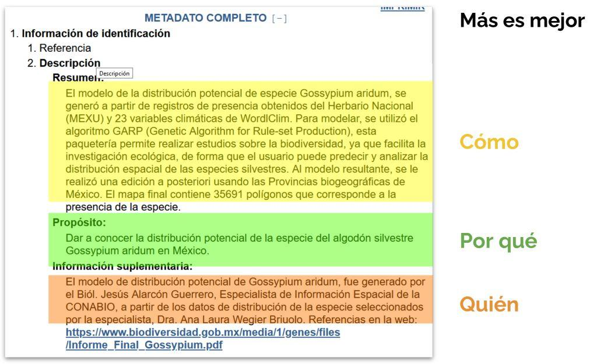
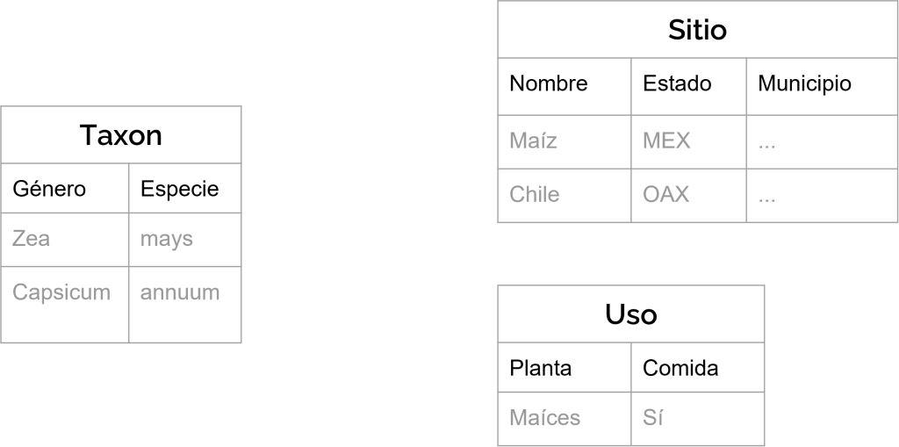
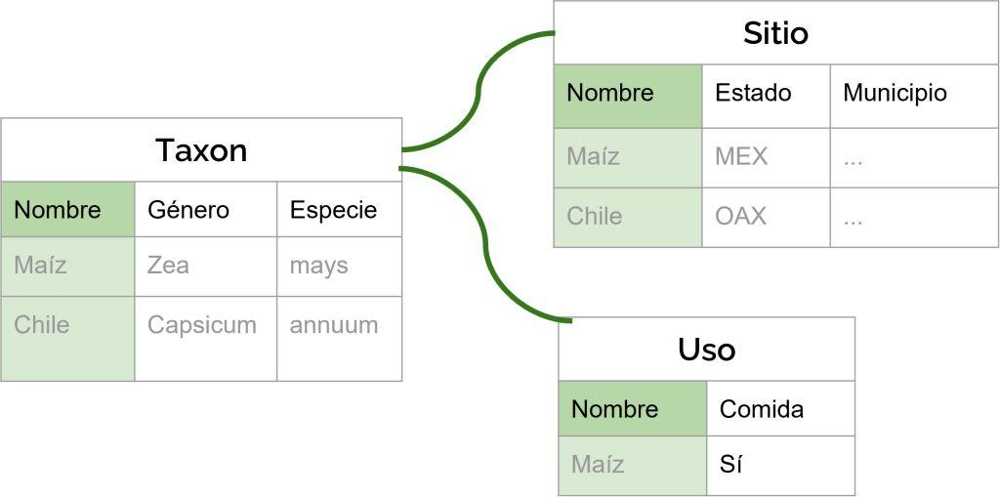
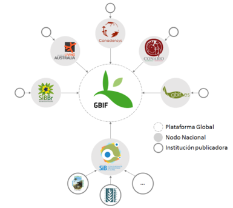
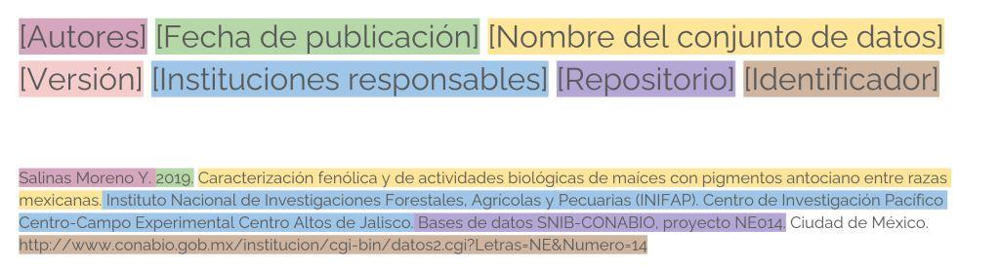

# Recomendaciones para encontrar, acceder, vincular y usar datos

## Abierto no es suficiente

¿Recuerdas alguna mala experiencia usando datos propios o de otra persona? ¿Qué paso?

Algunos ejemplos pueden ser:

* No sabías dónde encontrar datos de un tema que te interesaba.
* Estaban incompletos.
* Eran confusos y no pudiste entenderlos.
* Los pediste pero nunca te los dieron.
* No tenías el programa para abrirlos.
* Dudabas de su calidad.
* Se perdieron.

Hay muchos obstáculos técnicos o humanos que limitan el uso de los datos. Para que los datos realmente se puedan usar y compartir tanto como queramos, no es suficiente que tengan una licencia abierta. A continuación revisaremos un conjunto de recomendaciones para facilitar el uso y el manejo de los datos.

Esta sección está inspirada por los principios FAIR (las siglas en inglés de Findable, Accesible, Interoperable y Reusable). Estos principios son recomendaciones orientadas a facilitar el manejo de datos científicos. Aunque originalmente se definieron pensando en las computadoras, las recomendaciones también facilitan el uso de datos por personas. Entonces se trata de recomendaciones técnicas, con un componente humano.

## Encontrar

El primer paso para poder usar los datos es encontrarlos.

### Repositorios

¿Dónde encontramos datos?

Los repositorios son plataformas en línea donde se guardan contenidos digitales para el largo plazo. Entre los servicios que proveen se encuentran la curación de los materiales, el resguardo y las búsquedas avanzadas. Algunos repositorios se enfocan en datos, mientras que otros guardan materiales diversos como tesis, pre-publicaciones o código; algunos son gratuitos y otros cobran por el uso de sus servicios. Hay diferentes tipos de repositorios:

* Institucionales. Guardan los contenidos generados por una institución, quien gestiona el repositorio. Ejemplo: Portal de Datos abiertos de la UNAM.
* Temáticos. Se enfocan a materiales de un tema en particular, por lo que generalmente guardan contenidos especializados, proveen servicios de curación y generalmente requieren un proceso minucioso para subir materiales. Ejemplo: Sistema Nacional de Información de Biodiversidad de CONABIO.
* Múltiples disciplinas. Repositorios generales que guardan una gran diversidad de contenidos y temas. Ejemplo: Repositorio Nacional de CONACYT, DRYAD, Zenodo o Figshare.

### Metadatos

¿Cómo encontramos datos?

Los metadatos son información sobre los datos. Incluyen aspectos técnicos como el formato y la licencia de uso, así como información sobre el contexto donde fueron creados y una descripción del contenido. Entre mejor conozcamos un conjunto de datos, más fácil será poder encontrarlo y usarlo. Podemos pensar que preparar un archivo de metadatos es como escribir una biografía de los datos que debe incluir:

* ¿Quién colectó los datos?
* ¿Dónde se colectaron?
* ¿Cómo?
* ¿Cuándo?
* ¿Para qué fin?

Estos aspectos son importantes porque de ellos depende la interpretación de los datos. 

El siguiente ejemplo ilustra los metadatos de un conjunto de datos sobre la distribución potencial del algodón silvestre en México, obtenido del Geoportal de CONABIO. El archivo de metadatos es muy detallado. Para empezar incluye el nombre del conjunto de datos, el autor, la fecha de publicación, los formatos en los que está disponible para su descarga y la licencia de uso.

Cada sección de los metadatos contiene información suplementaria. Aquí se detalla el procedimiento que se usó para generar la distribución potencial del algodón, el por qué se generaron los datos y quiénes fueron responsables de los modelos e insumos usados para producir la base publicada. También se incluye un diccionario de datos, que es una descripción del contenido suficientemente detallada para que cualquier persona pueda entener; para cada columna del conjunto de datos, el diccionario describe su nombre, contenido, formato y valores permitidos. 

## Acceder

¿Cómo alguien puede acceder a los datos?

Incluso cuando los datos se publiquen de forma abierta, puede haber procedimientos que requieran la autenticación y autorización de usuarios para su acceso. Algunos casos donde esto ocurre es cuando un sistema de información o repositorio necesita llevar un control de los usuarios para conocer quiénes están usando los datos o para evitar la saturación de los servicios. En cualquier caso, debe existir un procedimiento explícito para acceder a los datos, con las indicaciones de autenticación, autorización e información de contacto de alguien responsable de asignar el acceso a los datos.

## Vincular

¿Por qué vincular datos?

Uno de los beneficios más grandes de tener datos abiertos es que se pueden enriquecer al vincularlos con otros datos. Para esto necesitamos que sean interoperables, es decir que los formatos y la estructura sean lo más parecido posible.

Veamos un ejemplo:

Aquí tenemos tres tablas sobre información taxonómica, geográfica y de uso del maíz y del chile. Si tenemos las tablas por separado, podemos hacer consultas aisladas, por ejemplo, ¿en qué estados y municipios se encuentra el chile? o ¿qué usos se le da al maíz? 

En cambio, si tuviéramos una columna en común que permitiera vincular las tablas, como el nombre en español de la especie, entonces podríamos hacer consultas más complejas. Podríamos responder en una sola consulta cuál es el nombre científico del chile, dónde se encuentra y para qué se usa.

### Estándares de datos

¿Cómo facilitamos la interoperabilidad?

Los estándares son acuerdos que se han desarrollado para usar los datos en un mismo formato y estructura: va desde cómo se nombran los campos hasta cómo se relacionan entre sí. Por ejemplo, el estándar Darwin Core define cómo presentar los datos biológicos y geográficos para biodiversidad, así que representa un lenguaje común para publicar este tipo de datos. Es el estándar que siguen los ejemplares del SNIB en CONABIO, y esto hace posible que los datos de otras instituciones que publican datos de biodiversidad en el mundo y que siguen este mismo estándar se puedan centralizar en un gran repositorio que es el GBIF. El desarrollo de estándares para biodiversidad ha sido un paso muy importante para entender patrones globales de biodiversidad, pues las investigaciones se basan en la integración de datos muy diversos pero estandarizados.

Uno de los retos de datos de agrobiodiversidad es que los estándares para datos sociales, culturales y de manejo están muy poco desarrollados a comparación de los datos biológicos o geográficos. Esto hace que sea difícil vincular datos de agrobiodiversidad. Por ejemplo: mantener integrados los componentes biológicos con los componentes sociales y culturales. Un ejemplo de estándares para este tipo de datos es la taxonomía de los usos y manejo de la biodiversidad de México de CONABIO [Ref]. 

## Reusar

¿Cómo facilitamos el reúso de los datos?

Los datos abiertos tienen la ventaja de que otras personas además de quienes los generaron pueden usarlos para fines distintos a los que se crearon, pueden convertirse en insumo de investigaciones futuras o integrarse en bases más grandes. Ya revisamos los metadatos y las licencias, dos herramientas indispensables para facilitar el reúso de datos. Citar un conjunto de datos es otra de las prácticas necesarias al reusar datos.

### Citar un conjunto de datos

Los datos son productos de investigación valiosos y se pueden publicar y citar de forma independiente a los artículos de investigación derivados, por ejemplo, en un repositorio. La forma apropiada de citar los datos es parecida a las citas de otras publicaciones académicas, desde el nombre de los autores, hasta. Aquí mostramos un ejemplo:

