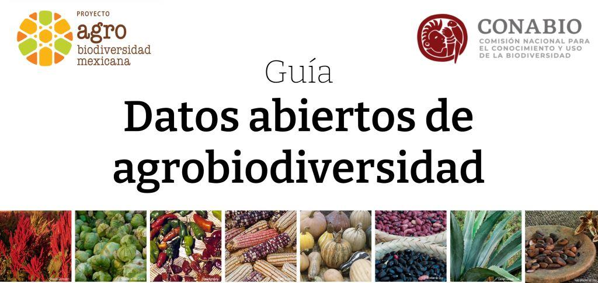

# Guía de datos abiertos sobre agrobiodiversidad

Esta guía es parte de los materiales desarrollados para el Sistema de Información de Agrobiodiversidad (SIAgroBD), dentro del [Proyecto GEF de Agrobiodiversidad Mexicana](https://biodiversidad.gob.mx/diversidad/proyectos/agrobiodiversidadmx) de CONABIO. La guía adapta los materiales del Taller de Datos abiertos sobre agrobiodiversidad, que se pueden consultar [aquí](https://doi.org/10.5281/zenodo.6640643).

## Objetivo

El objetivo de esta guía es introducir herramientas y prácticas de datos abiertos relevantes para la investigación sobre agrobiodiversidad y agroecosistemas tradicionales. Brindaremos una introducción a habilidades básicas de manejo de datos para reusar los datos del SIAgroBD y resaltaremos la colaboración como principio para la construcción de bases de datos. También compartiremos recursos para seguir aprendiendo sobre estos temas. 

## Capítulos

1. [Introducción](Intro.md).
2. [Datos de agrobiodiversidad](Datos_agrobiodiversidad.md).
3. [Ciencia abierta y datos abiertos](Ciencia_abierta_datos_abiertos.md).
4. [Recomendaciones para encontrar, acceder, vincular y usar datos](FAIR.md).
5. El ciclo de vida de los datos.

## Agradecimientos

La guía está coordinada por [Irene Ramos](https://github.com/iramosp), con contribuciones de [Alicia Mastretta](https://github.com/AliciaMstt) y del equipo de agrobiodiversidad en CONABIO.

Esta guía se deriva del Taller Datos abiertos de agrobiodiversidad, organizado como parte del programa [Open Life Science](https://openlifesci.org/), con la mentoría de [Piv Gopalasingam](https://github.com/pivg).

## Licencia

El contenido de esta guía se comparte bajo una licencia Creative Commons de Atribución (CC-BY).

## Contacto

Si te interesa colaborar, compartir tus dudas o comentarios, por favor contacta a [Irene Ramos](mailto:iramos@conabio.gob.mx).

